# BidForge Agent


BidForge Agent turns a complex enterprise RFP into a governed bid response workspace: compliance matrix, proposal draft, risk register, SME task routing, executive win brief, win strategy decisioning, ROI model, benchmark evidence, judge verification, automation history, and role-based approvals.

It is built for HCLTech-style presales operations where bid managers, sales, legal, finance, delivery, security, and SMEs need to collaborate quickly without losing human approval control.

## One-Line Pitch

BidForge Agent converts an RFP into a compliant, evidence-backed, reviewer-ready bid package in minutes while keeping humans, audit trails, and approval gates in control.

## Why It Can Win

BidForge is designed around what hackathon judges usually reward:

- **Clear business value:** faster RFP response cycles, fewer missed requirements, stronger governance, and measurable hours saved.
- **Agentic depth:** multiple specialized agents for intake, requirement extraction, capability matching, proposal writing, risk detection, SME routing, and judge verification.
- **Enterprise realism:** RBAC, audit trail, approval gates, role switching, admin tracker, prompt-injection guardrails, and automation.
- **Demo clarity:** every major artifact is visible through a shareable `?view=` route.
- **Measurable proof:** ROI simulator and benchmark mode turn the value story into numbers.
- **Human-in-the-loop trust:** final export is blocked until required gates are reviewed.

## Implemented Experience

| Area | What Works |
| --- | --- |
| Upload | Paste or select RFP text, run balanced review, trigger automation refresh |
| Dashboard | Run summary, quality score, token/latency, hours saved, agent timeline |
| Compliance Matrix | Extracted requirements, category, priority, evidence, owner, confidence |
| Proposal Draft | Generated proposal sections with unsupported claims marked |
| Source Evidence | Evidence drawer with reusable proposal bank snippets |
| Knowledge Base Studio | Govern approved snippets, stale evidence, linked requirements, and claims |
| Collaboration Inbox | Role queues, comments, decisions, SLA pressure, reviewer handoffs |
| Risk Register | Legal, finance, SLA, delivery, and security risk cards |
| SME Tasks | Kanban board by role and task status |
| Judge Report | Quality rubric for coverage, citations, hallucination control, risk detection |
| Executive Win Brief | Leadership-ready summary, win themes, risks, missing inputs, recommendation |
| Win Strategy | Bid/no-bid recommendation, win probability, blockers, role-owned next actions |
| Competitive Strategy Lab | Competitor radar, differentiator map, red-team objections, executive talk track |
| Export Pack | Download package JSON, Markdown memo, Word-compatible proposal, and PDF-ready print view |
| Admin Analytics | Readiness, bottlenecks, role workload, automation reliability |
| SLA Forecasting | Predict owner delays, escalation queue, automation cadence, next 24-hour plan |
| ROI Simulator | Editable effort/cost assumptions and exportable ROI scenario |
| Benchmark Mode | Manual baseline vs BidForge scorecard across 3 sample RFPs |
| Governance | RBAC roles, approval gates, controls, audit trail |
| AI Governance Scorecard | Evidence grounding, prompt-injection quarantine, model risk, and human gates |
| End-to-End Role Flow | Switch Legal/Finance/Security/Delivery/Admin, approve gates, track status |
| Integration Simulator | Mock SharePoint, Teams, CRM, pricing, legal, and audit sync status |
| Automation | 5-minute cadence, run now, pause/resume, frequency edit, persisted history |

## Screenshots

### Dashboard

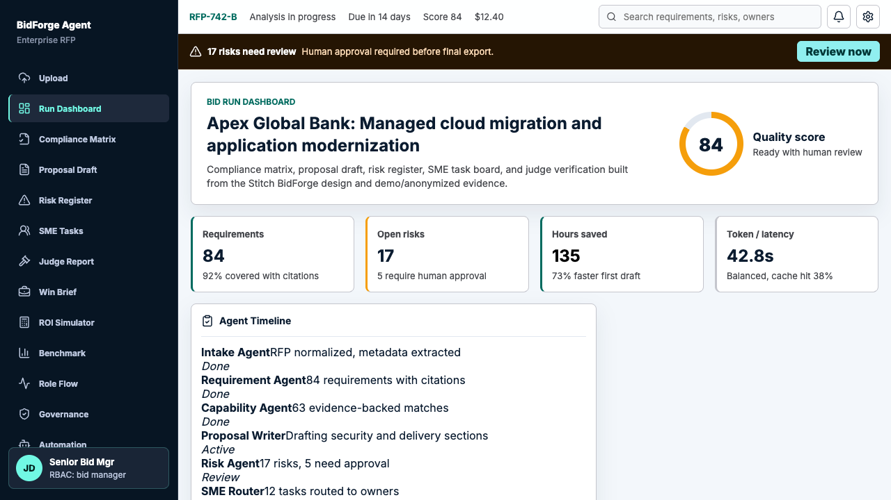

### End-to-End Role Flow

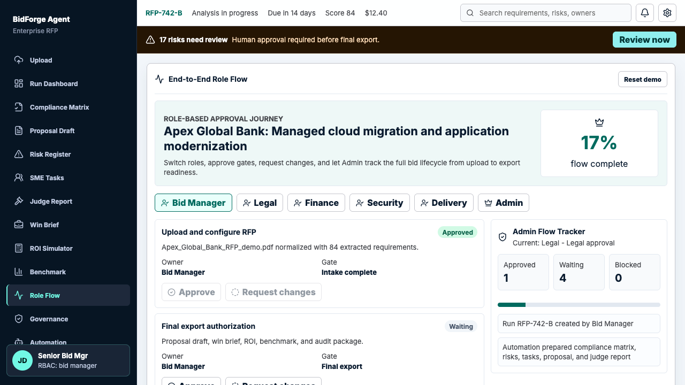

### Win Strategy

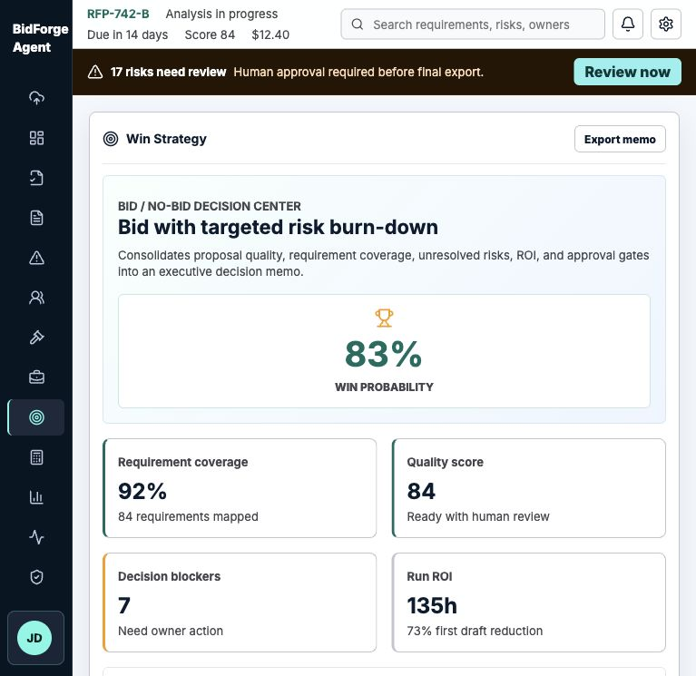

### Competitive Strategy Lab

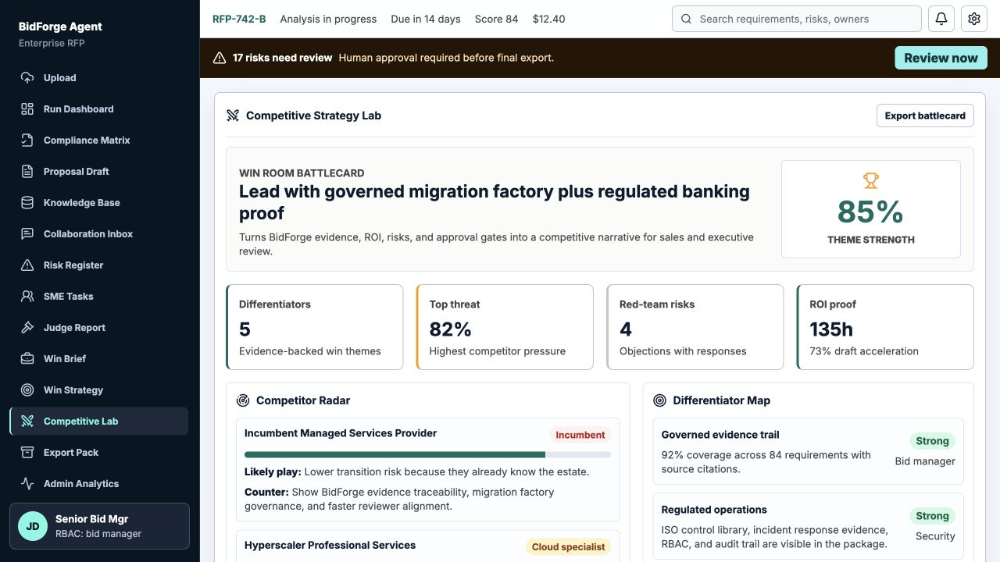

### Knowledge Base Studio

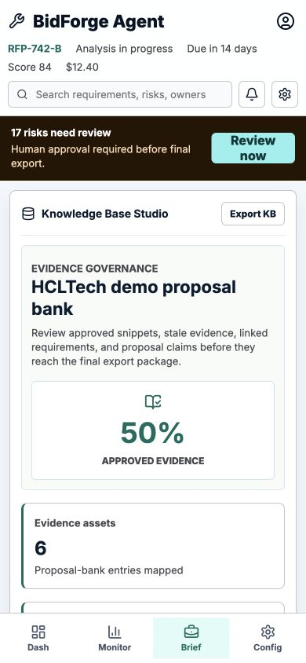

### Collaboration Inbox

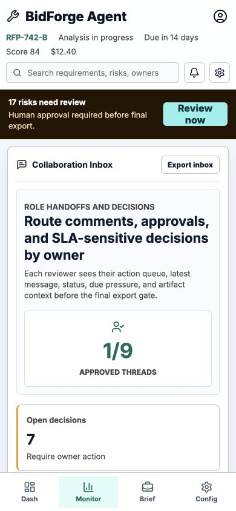

### Export Pack

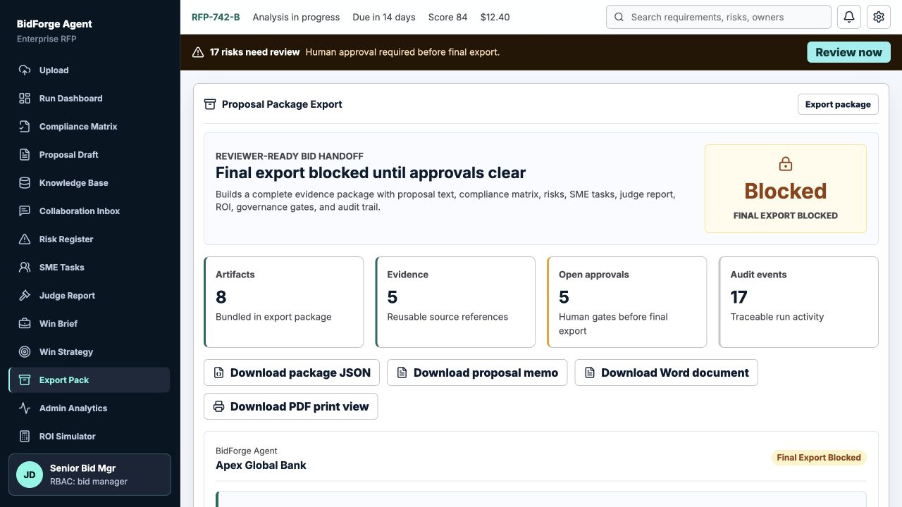

### Admin Analytics

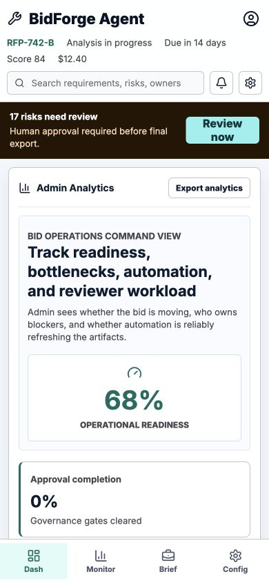

### SLA Forecasting

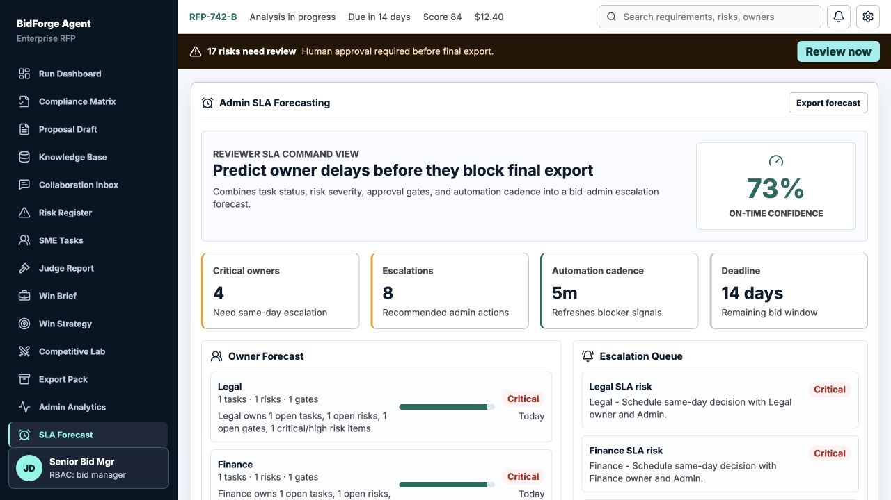

### Integration Simulator

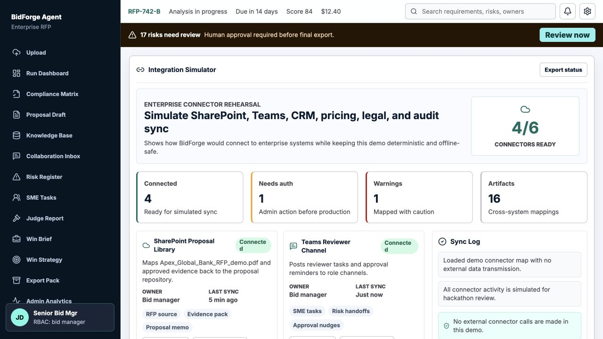

### ROI Simulator


### Governance

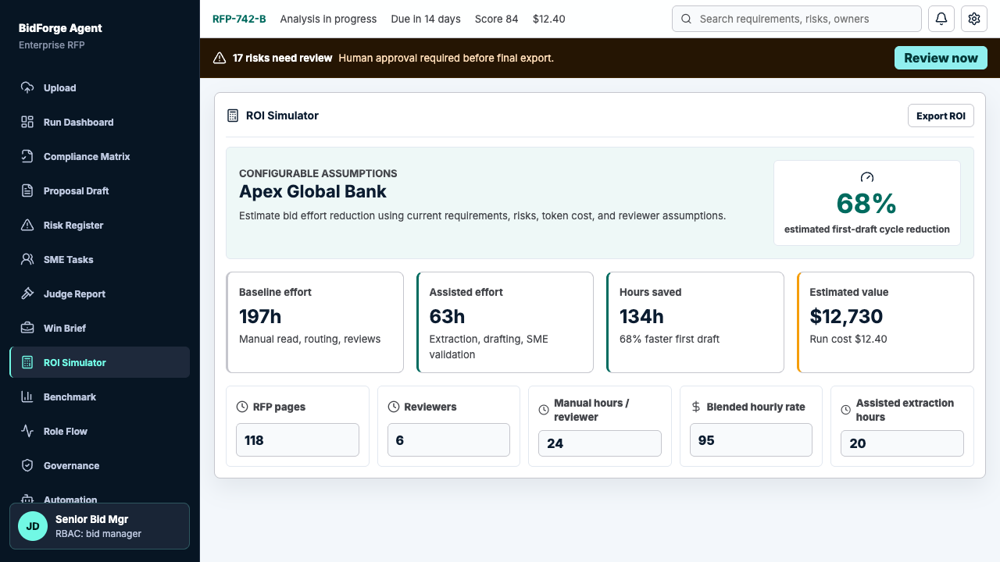

### AI Governance Scorecard

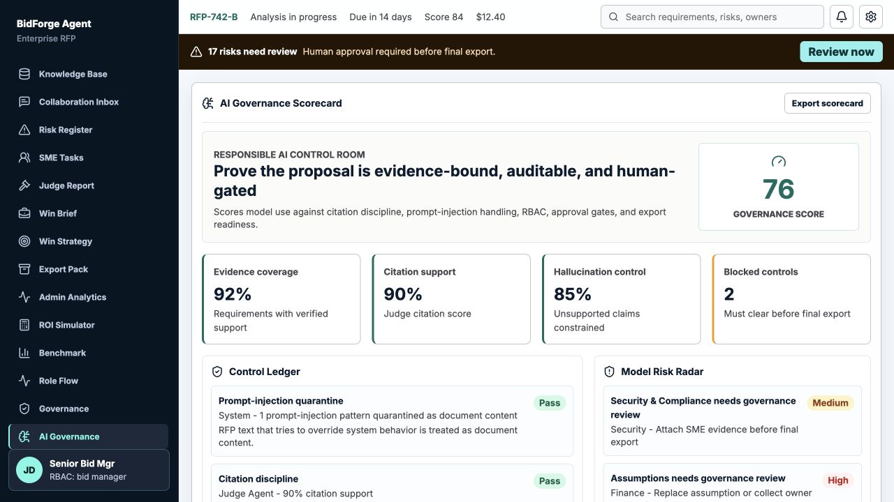

### Benchmark Mode

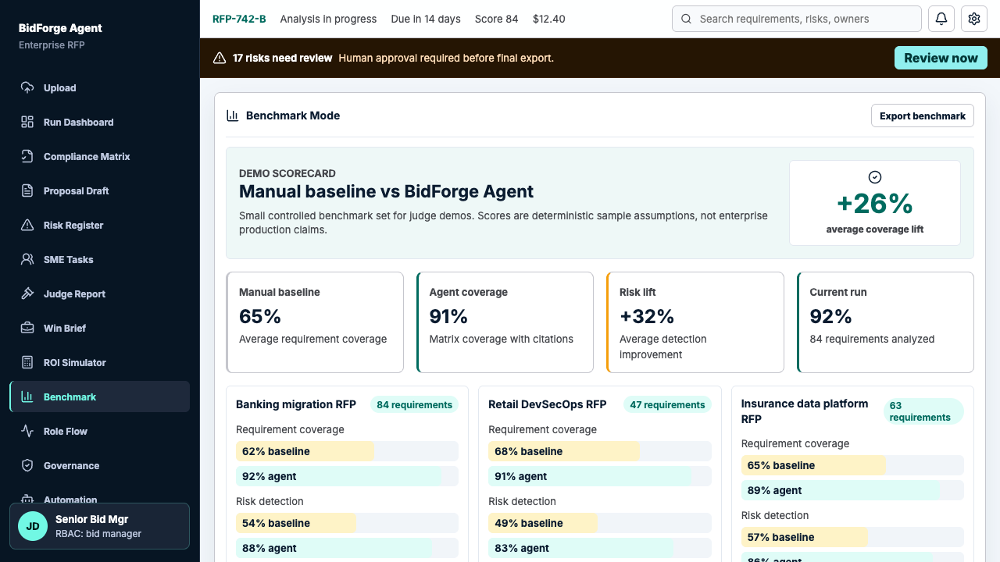

## Demo Routes

All links are shareable query routes, not hash routes.

```text
http://localhost:5174?view=dashboard
http://localhost:5174?view=upload
http://localhost:5174?view=matrix
http://localhost:5174?view=proposal
http://localhost:5174?view=knowledge
http://localhost:5174?view=inbox
http://localhost:5174?view=risks
http://localhost:5174?view=tasks
http://localhost:5174?view=judge
http://localhost:5174?view=brief
http://localhost:5174?view=strategy
http://localhost:5174?view=competitive
http://localhost:5174?view=package
http://localhost:5174?view=analytics
http://localhost:5174?view=sla
http://localhost:5174?view=roi
http://localhost:5174?view=benchmark
http://localhost:5174?view=flow
http://localhost:5174?view=governance
http://localhost:5174?view=ai-governance
http://localhost:5174?view=integrations
http://localhost:5174?view=automation
```

## Quick Start

Install dependencies:

```bash
npm install
```

Run the full demo with one command:

```bash
npm run demo
```

Or run the API and web app separately:

```bash
npm run dev:api
npm run dev:web
```

Environment example:

```text
VITE_BIDFORGE_API_BASE=http://127.0.0.1:8787
```

Open:

```text
http://localhost:5174
```

## Validation

```bash
npm run test:api
npm run build:web
```

Current validation status:

- API unit tests: 34 passing
- Web production build: passing
- Browser smoke tested across all routes and key flows

## Demo Flow For Judges

1. Open Dashboard and explain the RFP run summary.
2. Go to Upload, paste a small RFP, and run balanced review.
3. Show Compliance Matrix with extracted requirements and evidence.
4. Show Knowledge Base Studio to approve snippets, find stale evidence, and govern proposal claims.
5. Show Collaboration Inbox to route comments, answer a thread, and approve a handoff.
6. Show Risk Register and send to reviewer.
7. Show Proposal Draft and Source Evidence.
8. Show Judge Report to prove quality and hallucination control.
9. Show Win Strategy to explain bid/no-bid recommendation, win probability, blockers, and role-owned actions.
10. Show Competitive Strategy Lab to explain competitor threats, differentiators, and red-team responses.
11. Show Export Pack and download the package JSON, memo, Word-compatible proposal, and PDF-ready print view.
12. Show Admin Analytics for bottlenecks, role workload, automation reliability, and readiness.
13. Show SLA Forecasting to predict owner delays and recommended escalations.
14. Show Role Flow, switch to Legal, approve legal gate, then switch to Admin.
15. Show Governance, audit trail, and blocked final export gates.
16. Show AI Governance Scorecard to prove evidence grounding, guardrails, model risks, and human gates.
17. Show ROI Simulator and export ROI.
18. Show Benchmark Mode and export benchmark evidence.
19. Show Integration Simulator and sync a connector.
20. Show Automation running on a 5-minute cadence.

## Architecture

See [architecture.md](./architecture.md).

High-level shape:

```text
React/Vite Command Center
  -> API client with local fallback
  -> Python HTTP API
  -> BidForge Orchestrator
  -> Agent modules + deterministic derivation
  -> Automation scheduler + JSON persistence + audit store
```

## Agent Workflow

| Agent | Responsibility |
| --- | --- |
| Intake Agent | Normalize uploaded RFP, detect metadata, detect prompt injection |
| Requirement Agent | Extract requirements with IDs, category, priority, owner, evidence |
| Capability Agent | Match requirements to demo knowledge snippets |
| Proposal Agent | Draft proposal sections using supported evidence |
| Risk Agent | Flag legal, compliance, SLA, delivery, commercial, and security risks |
| SME Router Agent | Create reviewer tasks by role |
| Judge Agent | Score coverage, citations, hallucination control, and readiness |

## Technology Stack

| Layer | Technology |
| --- | --- |
| Frontend | React, TypeScript, Vite |
| UI Icons | lucide-react |
| Styling | CSS modules by convention in `styles.css` with responsive command-center layout |
| API | Python stdlib `ThreadingHTTPServer` for dependency-light demo |
| Orchestration | Python agent classes and deterministic workflow derivation |
| Persistence | Local JSON runtime state for automation and audit trail |
| Tests | Python `unittest`, TypeScript build, browser smoke through Playwright CLI |
| Design Source | Stitch BidForge command-center screens in `docs/stitch_bidforge_agent_command_center/` |

## Project Structure

```text
bidforge-agent/
  apps/web/                         React/Vite command center
  services/api/                     Python API and orchestration layer
  docs/                             Product, demo, and design docs
  docs/screenshots/                 README screenshots
  scripts/                          Demo/deck helper scripts
  architecture.md                   System architecture and flow
  DECK.pdf                          Judge-facing pitch deck
  SUBMISSION.md                     Submission checklist and pitch summary
```

## API Endpoints

```text
GET  /health
GET  /api/runs/demo
POST /api/runs
GET  /api/automations/current
POST /api/automations/current
POST /api/automations/current/run
POST /api/automations/current/pause
POST /api/automations/current/resume
POST /api/automations/current/tick
```

## Security And Governance Story

- Prompt-injection patterns are detected and quarantined as document content.
- Automation mutation requires `bid_manager` or `admin`.
- Denied actions are audited.
- Admin can track role gates through the End-to-End Role Flow.
- Final export remains blocked while required gates are open.
- Generated claims are marked `Needs SME` or `Unsupported` when evidence is missing.

## Winning Artifacts

- [SUBMISSION.md](./SUBMISSION.md)
- [architecture.md](./architecture.md)
- [docs/problem-statement.md](./docs/problem-statement.md)
- [docs/solution-savings.md](./docs/solution-savings.md)
- [docs/final-demo-plan.md](./docs/final-demo-plan.md)
- [docs/demo-script.md](./docs/demo-script.md)
- [docs/judging-checklist.md](./docs/judging-checklist.md)
- [docs/automation-feature.md](./docs/automation-feature.md)
- [DECK.pdf](./DECK.pdf)

## Known Limitations

- The hackathon demo uses deterministic derivation for repeatable judging. Production would replace this with a governed LLM/RAG pipeline.
- The knowledge base is mocked with demo proposal-bank snippets. Production would connect SharePoint, CRM, legal clause libraries, pricing tools, and service catalogs.
- The API uses Python stdlib HTTP for portability. Production should use FastAPI or an enterprise API gateway with SSO.
- Local JSON persistence is used for demo continuity. Production should use a database and immutable audit log.
- Proposal document exports are browser-generated for the demo. Production should render server-side DOCX/PDF with enterprise templates and locked branding.

## Production Roadmap

| Phase | Upgrade |
| --- | --- |
| Pilot | Connect SharePoint/Teams folders and sample proposal repository |
| Enterprise API | Replace stdlib HTTP adapter with FastAPI, auth middleware, and database persistence |
| Integrations | CRM, pricing tools, legal clause library, approval workflow, Microsoft Graph |
| AI Layer | Replace deterministic derivation with governed LLM/RAG pipeline and vector retrieval |
| Observability | Add run metrics, reviewer SLA tracking, quality drift dashboards, and cost attribution |
| Security | SSO, tenant isolation, encryption, policy engine, enterprise audit export |

## License

Hackathon prototype. Internal evaluation only unless a license is added.
