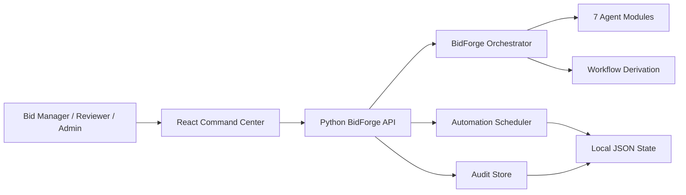
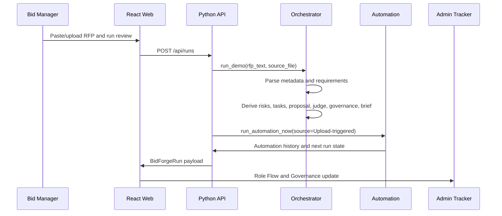
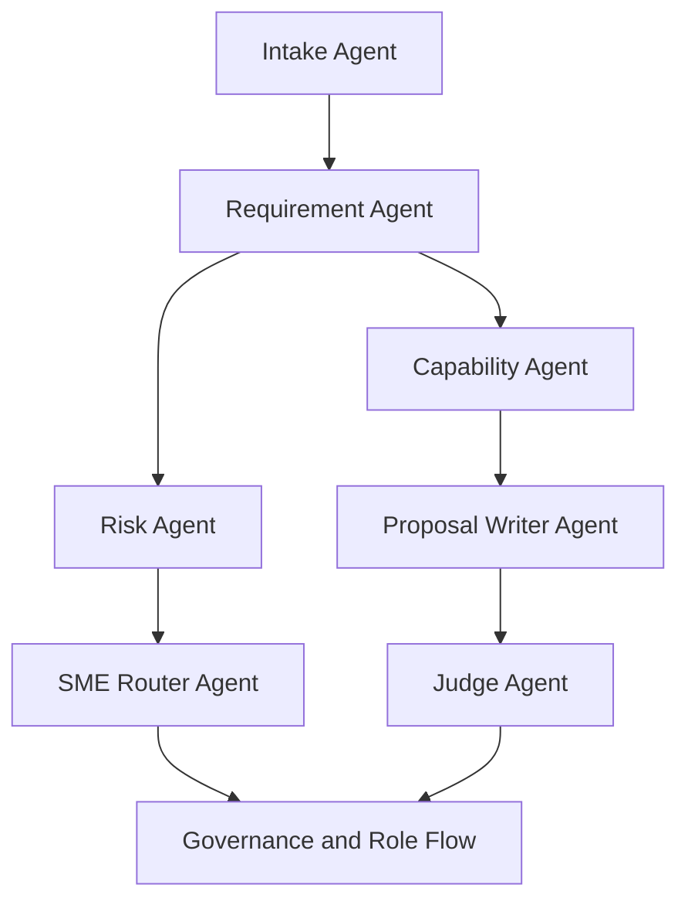
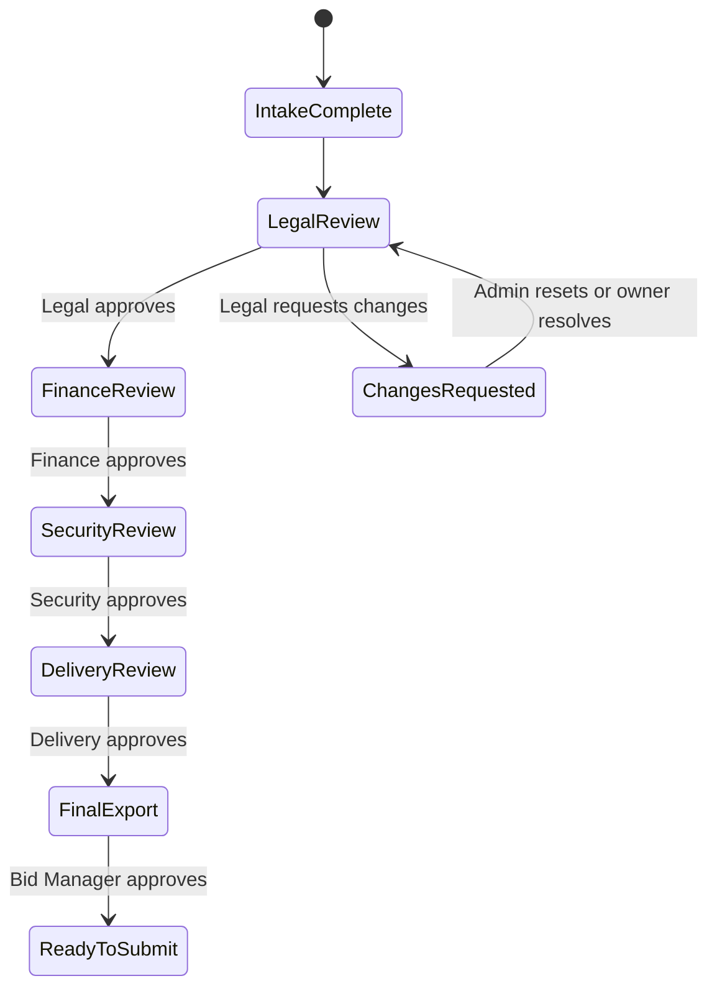

# BidForge Agent Architecture

## Purpose

BidForge Agent is a governed RFP response workspace. It converts uploaded RFP text into bid artifacts and routes them through human approval gates.

The architecture is intentionally lightweight for hackathon reliability:

- React/Vite frontend for a polished command center.
- Python stdlib API to avoid backend dependency friction.
- Deterministic orchestration so the demo is repeatable.
- Local JSON persistence for automation and audit state.
- Clean module boundaries for future FastAPI, database, and LLM/RAG upgrades.

## System Context



## Runtime Components

| Component | Path | Responsibility |
| --- | --- | --- |
| Web app | `apps/web` | Command center UI and role workflow |
| API server | `services/api/app/main.py` | HTTP routes, CORS, health, scheduler lifecycle |
| Orchestrator | `services/api/app/core/orchestrator.py` | Runs agents and assembles `BidForgeRun` |
| Derivation | `services/api/app/core/workflow_derivation.py` | Creates risks, tasks, proposal sections, judge report, governance |
| Document intake | `services/api/app/core/document_intake.py` | Parses pasted/uploaded RFP text |
| Guardrails | `services/api/app/core/guardrails.py` | Detects prompt-injection patterns |
| Automation service | `services/api/app/core/automation_service.py` | Run now, scheduled tick, frequency, pause/resume |
| Automation scheduler | `services/api/app/core/automation_scheduler.py` | Background 5-minute cadence checks |
| Audit store | `services/api/app/core/audit_store.py` | Records run and automation actions |
| RBAC | `services/api/app/core/rbac.py` | Allows bid manager/admin automation operations |

## Data Flow



## Frontend Views

| View | Route | Judge Value |
| --- | --- | --- |
| Dashboard | `?view=dashboard` | Executive run summary and quality score |
| Upload | `?view=upload` | Starts a real RFP review flow |
| Compliance Matrix | `?view=matrix` | Shows extracted requirements and evidence |
| Proposal Draft | `?view=proposal` | Shows generated response sections and evidence |
| Risk Register | `?view=risks` | Shows review blockers and owners |
| SME Tasks | `?view=tasks` | Shows routed tasks by status |
| Judge Report | `?view=judge` | Shows verification and hallucination control |
| Win Brief | `?view=brief` | Sales-leadership one-page summary |
| ROI Simulator | `?view=roi` | Quantifies hours saved and cost value |
| Benchmark | `?view=benchmark` | Compares manual baseline vs agent output |
| Role Flow | `?view=flow` | Full role-based approval lifecycle |
| Governance | `?view=governance` | RBAC, gates, controls, audit trail |
| Automation | `?view=automation` | 5-minute cadence, run now, pause/resume, history |

## Agentic Workflow



## Approval And Admin Flow



## Data Model Highlights

The frontend and API share a single run shape:

- Run metadata: buyer, project, deadline, score, latency, token cost.
- Upload config: file, size, knowledge base, mode, warning.
- Requirements table.
- Proposal sections.
- Evidence sources.
- Risk register.
- SME tasks.
- Judge report.
- Executive brief.
- Governance panel.
- Automation config and history.
- Audit trail.

## Automation Architecture

Automation is designed as an enterprise-safe refresh loop:

- Default frequency: 5 minutes.
- Manual `Run now` supported.
- Pause/resume supported.
- Frequency edit supported.
- Background scheduler starts with API.
- Upload-triggered run records audit and refreshes artifacts.
- State persists to local JSON for demo continuity.
- RBAC protects mutation endpoints.

## Security And Trust Controls

| Control | Implementation |
| --- | --- |
| Prompt-injection defense | `guardrails.py` detects hostile document instructions |
| RBAC | `rbac.py` limits automation operations to bid manager/admin |
| Audit | `audit_store.py` records completed and denied actions |
| Human gates | Governance and Role Flow block final export while approvals remain |
| Hallucination control | Judge report scores citation support and unsupported claims |
| Fallback safety | Frontend falls back to deterministic demo data if API is offline |

## Scalability Roadmap

| Hackathon Component | Production Upgrade |
| --- | --- |
| Python stdlib HTTP server | FastAPI or enterprise API gateway |
| Local JSON state | Postgres + object storage |
| Deterministic knowledge snippets | RAG over SharePoint, proposal bank, service catalog |
| Local role flow | Enterprise workflow engine or ServiceNow/Jira integration |
| Demo RBAC | SSO, SCIM, Azure AD groups |
| Basic audit | Immutable audit log and SIEM export |
| Local benchmark | Curated evaluation set and model-quality monitoring |

## Deployment Notes

The demo is optimized for local execution:

```bash
npm install
npm run dev:api
npm run dev:web
```

Expected URLs:

```text
Web: http://localhost:5174
API: http://127.0.0.1:8787
Health: http://127.0.0.1:8787/health
```
